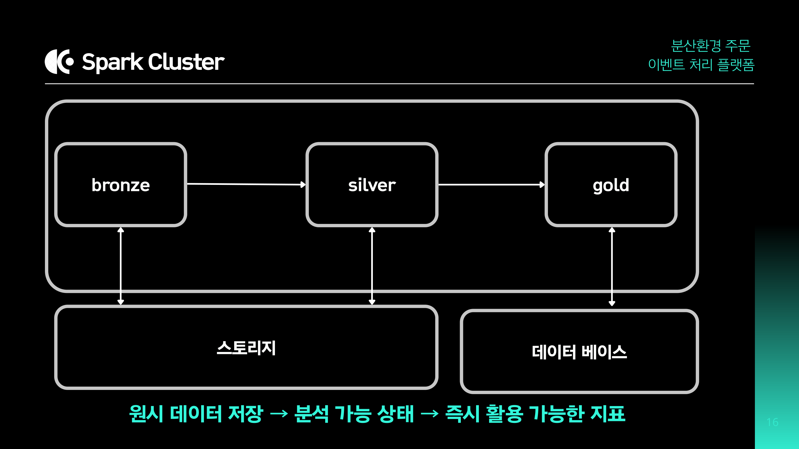
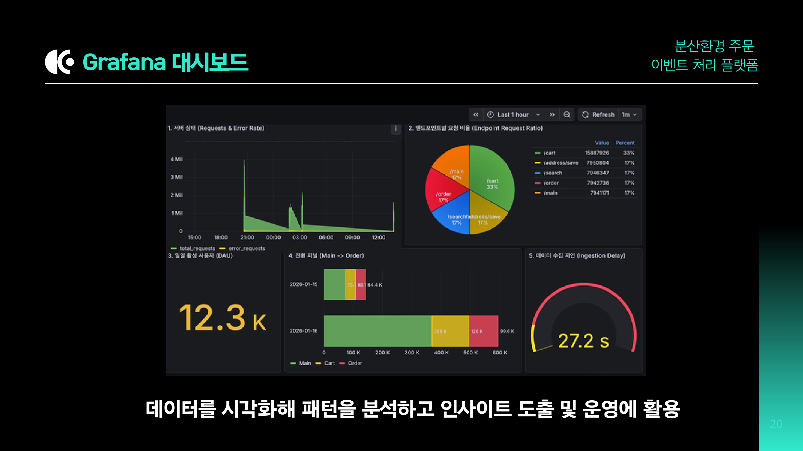
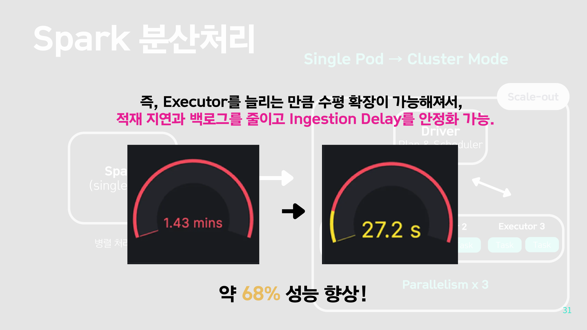

# 분산환경 주문 이벤트 처리 플랫폼

> BOAZ 23rd Conference — 팀 백 투 더 엔지
> 발표 자료: [Back-to-Eng.pdf](../Back-to-Eng.pdf)

배달 플랫폼 유저 행동 로그를 Kafka로 수집하고, Spark Structured Streaming으로 실시간 처리하여 ClickHouse에 집계 후 Grafana로 시각화하는 스트리밍 데이터 파이프라인

---

## 배경

배달 앱은 MAU보다 **DAU**가 핵심 지표. 매일 앱을 여는 헤비 유저가 서비스 성패를 결정하기 때문에, 유저의 실시간 행동 흐름(로그인 → 검색 → 장바구니 → 결제 → 이탈)을 즉시 모니터링할 수 있는 파이프라인이 필요했음

---

## Architecture

```
[WAS (Log Generator)]
  Spring Boot, 유저 행동 로그 생성
  로그인 / 카테고리 선택 / 식당 검색 / 메뉴 담기 / 결제 / 주문 이탈
        │
        ▼ topic: user-activity-logs
[Kafka Cluster]
  Broker x3, Partition x3, Replication Factor x3
        │
        ▼
[Spark Cluster — Medallion Architecture]
  ┌─────────┐    ┌─────────┐    ┌─────────┐
  │ Bronze  │ →  │ Silver  │ →  │  Gold   │
  │ raw JSON│    │ Parquet │    │ 집계 결과│
  └─────────┘    └─────────┘    └─────────┘
        │               │               │
        ▼               ▼               ▼
     MinIO           MinIO         ClickHouse
  (raw-data/)      (silver/)      (logs.*)
                                       │
                                       ▼
                                   [Grafana]
                              5개 대시보드 패널
```



---

## 레이어별 역할

| 레이어 | 파일 | 저장소 | 역할 |
|---|---|---|---|
| Bronze | `minio_e.py` | MinIO `raw-data/` | Kafka raw 로그 수신, 재처리 기준 원천 |
| Silver | `minio_t.py` | MinIO `silver/` | 정규표현식 파싱, Parquet 변환, year/month/day/hour 파티셔닝 |
| Gold | `clickhouse_gold_connector.py` | ClickHouse `logs.*` | 5가지 분석 메트릭 집계 및 적재 |

---

## 구현 포인트

**Medallion Architecture**
Bronze → Silver → Gold를 독립적인 Spark Streaming job으로 분리. 레이어별 장애 격리 및 재처리 가능

**정규표현식 기반 로그 파싱**
구조화되지 않은 raw 로그를 정규표현식으로 파싱하여 event_type / user_id / endpoint / http_method / status 추출
스키마와 타입을 명시적으로 규정해 임의 해석 차단

**세션 기반 퍼널 분석**
`Window.partitionBy("date_bucket", "user_id").orderBy(event_ts DESC)`로 세션 단위 추적
MAIN → BROWSE → CART_ADD → ORDER 순서를 보장한 전환율 계산

**이탈 지점 분석**
`row_number().over(window_spec)`으로 유저별 마지막 이벤트를 추출하여 어디서 이탈했는지 파악

**foreachBatch 멀티 테이블 쓰기**
단일 배치에서 5개 분석 테이블을 동시에 ClickHouse에 적재하여 배치 재처리 비용 최소화

**p95/p99 응답 분포**
`percentile_approx`로 p50/p95/p99 측정. 평균이 아닌 분위수로 실제 서비스 성능 모니터링

---

## ClickHouse 집계 테이블 (5개)

| 테이블 | 집계 단위 | 주요 지표 |
|---|---|---|
| `metrics_server_health_minutely` | 분 | total_requests, error_rate, unique_users |
| `metrics_operational_hourly` | 시간 | endpoint별 request_count, error_rate, p95 |
| `metrics_business_daily` | 일 | 이벤트 행동 + 이탈 지점 (ACTION / DROPOFF) |
| `metrics_funnel_daily` | 일 | Main→Cart→Order 전환율 |
| `metrics_data_quality_hourly` | 시간 | null 비율, avg_delay_seconds |

---

## Grafana 대시보드



| 패널 | KPI | 활용 |
|---|---|---|
| 서버 상태 | total_requests (rpm), error_rate (%) | 장애/과부하 조기 감지 |
| 엔드포인트별 요청 비율 | endpoint별 request_count | 주요 API 사용 패턴 파악 |
| DAU | max(unique_users) | 일일 서비스 활성도 |
| 전환 퍼널 | main_users → cart_add_users → order_users | 단계별 이탈률/병목 구간 |
| 데이터 수집 지연 | avg_delay_seconds | 파이프라인 실시간성 검증 |

Discord 알림 봇 연동: Error Rate > 5% (2분 지속) / 데이터 미수집 10분 지속 시 Critical 알림

---

## 트러블슈팅

**1. Gold 적재 지연 — Single Pod → Cluster Mode**



Gold 로그에서 배치 크기가 7,285,891 records까지 누적되어 처리 속도가 점점 느려지는 현상 발생
Spark를 Single Pod에서 Cluster Mode (Driver + Executor x2)로 전환하여 수평 확장
Ingestion Delay: 1.43분 → 27.2초, **약 68% 성능 향상**

**2. Pod 재시작 시 체크포인트 유실**

체크포인트를 Pod 내부(`/tmp`)에 저장하면 Pod 재시작 시 소멸 → 배치 0부터 재처리 발생
체크포인트를 PVC(`/app/checkpoints`) 또는 MinIO(`s3a://`)로 이관하여 해결

**3. Kafka 오프셋 증가량 감소 — ISR Rebalancing**

분당 Kafka 오프셋 증가량이 감소하는 현상 → Kafka Broker 장애로 ISR에 속한 파티션이 리더로 재선출되는 Rebalancing 과정에서 일시적으로 발생

---

## 로컬 실행

```bash
docker-compose up -d
```

| 서비스 | 포트 |
|---|---|
| Kafka | 9092 |
| MinIO Console | 9001 |
| ClickHouse HTTP | 8123 |
| Grafana | 3000 |
| Spark UI (Bronze) | 4040 |
| Spark UI (Silver) | 4041 |
| Spark UI (Gold) | 4042 |

---

## 참고

- ClickHouse 스키마: `clickhouse/schema.sql`
- Grafana 대시보드: `grafana/dashboards/monitoring.json`
